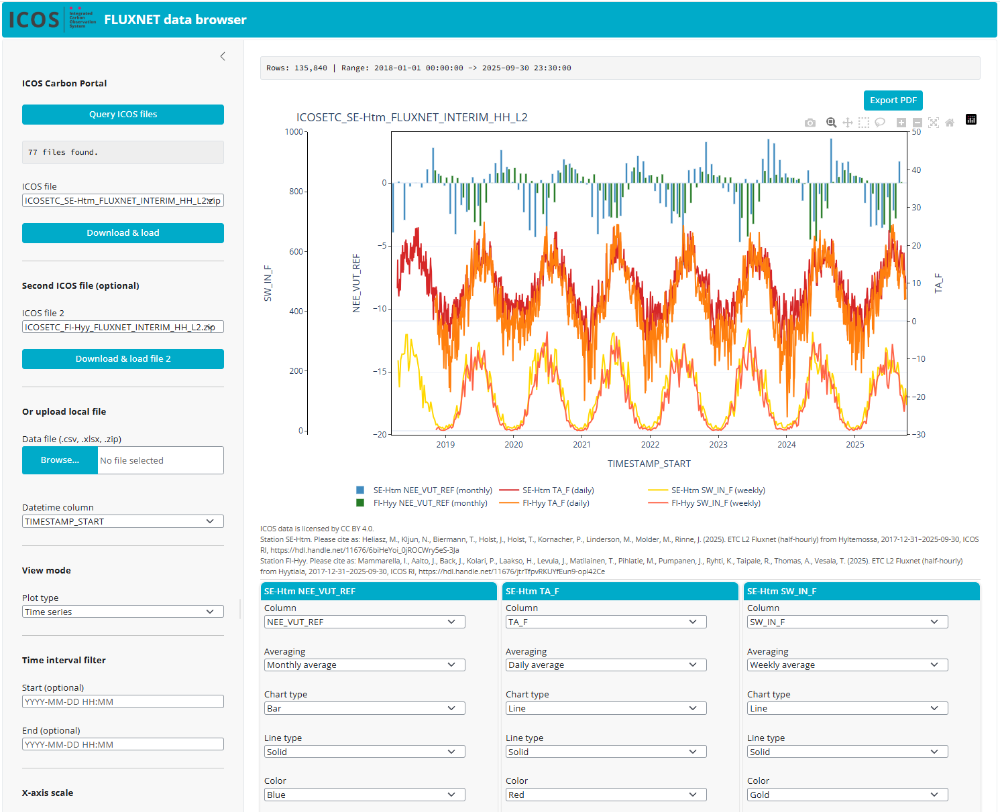

# ICOS Ecosystem FLUXNET Data Browser

A **Shiny for Python** web application for interactive time series analysis of [ICOS](https://www.icos-cp.eu/) Ecosystem Thematic Centre (ETC) Level 2 FLUXNET data.


## Features

- **ICOS Carbon Portal integration** – Query and download ETC L2 FLUXNET files directly from the [ICOS Carbon Portal](https://data.icos-cp.eu/) via SPARQL.
- **Local file upload** – Alternatively load CSV, Excel (.xlsx/.xls) or ZIP files from disk.
- **Smart datetime parsing** – Automatically detects datetime columns and handles compact numeric formats (YYYYMMDDHHMM, YYYYMMDD) as well as ISO timestamps.
- **Up to 6 simultaneous series** – Select different columns and assign independent settings per series.
- **Averaging** – Aggregate half-hourly data to daily, weekly or monthly means.
- **View modes** – Time series, average by time of day (30 min / hourly), week of year, or month of year profiles.
- **Multiple chart types** – Line plots and bar charts (grouped bars for multi-series).
- **Line styles & colours** – Per-series configurable colour (18 named colours) and line type (solid, dash, dot, dash-dot).
- **4 Y-axes** – Assign each series to one of four independent Y-axes (2 left, 2 right) with auto-shifting.
- **X-axis control** – Auto-scale or manually set min/max datetime range.
- **Interactive plots** – Powered by [Plotly](https://plotly.com/python/) with pan, zoom, hover and export.

## Screenshots



## Quick Start

### Prerequisites

- Python 3.10 or newer

### Installation

```bash
# Clone the repository
git clone https://github.com/ICOS-Carbon-Portal/shiny-fluxnet-browser.git
cd shiny-fluxnet-browser

# Create and activate a virtual environment
python -m venv .venv
# Windows
.venv\Scripts\activate
# Linux / macOS
source .venv/bin/activate

# Install dependencies
pip install -r requirements.txt
```

### Run

```bash
shiny run app.py
```

Open http://127.0.0.1:8000 in your browser.

## Usage

1. **Load data** – Either click *Query ICOS files* to browse the ICOS Carbon Portal, or upload a local file.
2. **Select columns** – In the Series cards (S1–S6) pick numeric columns to plot.
3. **Configure** – Choose averaging period, chart type, line style, colour, and Y-axis per series.
4. **Explore** – Switch between time series and profile view modes. Filter by time interval. Adjust X-axis range.

## Dependencies

| Package | Purpose |
|---|---|
| [shiny](https://shiny.posit.co/py/) | Web application framework |
| [shinywidgets](https://github.com/posit-dev/py-shinywidgets) | Plotly widget integration |
| [plotly](https://plotly.com/python/) | Interactive charting |
| [pandas](https://pandas.pydata.org/) | Data manipulation and resampling |
| [requests](https://docs.python-requests.org/) | ICOS Carbon Portal HTTP access |
| [openpyxl](https://openpyxl.readthedocs.io/) | Excel file support |

## Data Source

This app queries **ICOS ETC Level 2 FLUXNET** data products from the [ICOS Carbon Portal](https://www.icos-cp.eu/data-services/about-data-portal). Data is provided under the [ICOS Data Licence](https://data.icos-cp.eu/licence).

## License

This project is open source. See the repository for licence details.

## Acknowledgements

This application was developed with the assistance of [Claude Opus 4.6](https://www.anthropic.com/) (Anthropic).
